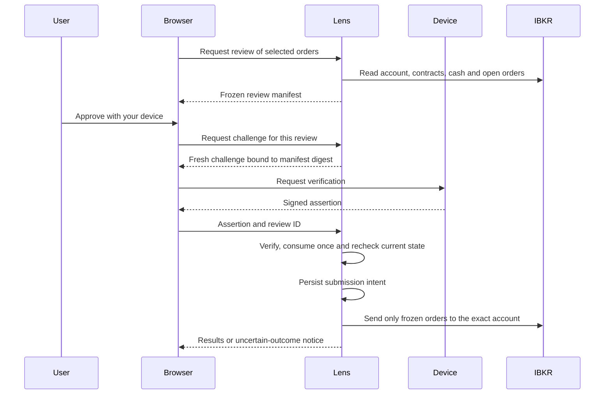

# Device approval for Lens

Status: implemented for opt-in testing, 12 September 2026. The original design
below was based on `2998996`; the table records findings before implementation.

The implementation now freezes review/account/limits, verifies WebAuthn assertions,
and supports separate opt-in paper/live activation after a no-trade test. Default
order approval remains PIN until explicitly activated. PIN retirement, device
approval for cancellation, app locking and file encryption are still deferred.
The PIN remains required for cancellation and approval-setting changes. This is
an explicit transition design, not a claim that all original milestones shipped.

Tests use real cryptographic verification with synthetic authenticators and mocked
brokers. They do not prove physical Touch ID / Windows Hello compatibility or
successful real broker execution. The user performs hardware verification and any
actual paper/live submission. No test orders have been placed by the coding agent.

Implementation differences: challenges and reviews are bound to an expiring
browser token; device authority has its own local user handle. There is no durable
broker-login generation because Gateway exposes no login nonce here. Actual
account identity is rechecked at review, submission and before each placement.
Observed disconnects clear browser review; an unobserved disconnect/reconnect to
the same account is not claimed to be detectable. Executable manifests and the
pending marker are written durably before the subprocess starts. Recovery after
a possibly partial submission continues to require broker reconciliation.

The remaining text is the original design roadmap; use the README for current
setup instructions and supported behavior.

## Decision

Prototype browser WebAuthn first, using a local public-key verifier. This keeps
Lens in the browser and needs no Lens email, password, cloud service or native
wrapper. Ship it only after real-device testing and the execution prerequisites
below pass. Start with a demonstration that cannot reach order endpoints.

WebAuthn supports a localhost origin and user-verifying authenticators. Its
verification can involve biometrics or a device PIN/password; Lens must not
promise a fingerprint on every approval. Use the label **Approve with your
device**, with Touch ID / Windows Hello examples where appropriate.
[W3C WebAuthn](https://www.w3.org/TR/webauthn-3/#sctn-rp-operations)

Windows supports passkeys through Windows Hello, including biometric or PIN
verification. Actual browser and device behavior still needs testing.
[Microsoft](https://learn.microsoft.com/en-us/windows/security/identity-protection/passkeys/)
Apple passkeys can sync through iCloud Keychain or other providers. The profile,
portfolio and order records remain local to Lens, but a passkey may be managed
outside Lens. Disclose this before enrollment; do not call it a device-bound key.
[Apple](https://developer.apple.com/passkeys/)

If testing shows the required local experience is unavailable, or strictly
non-synchronizing keys become a requirement, investigate a signed native helper
as a separate decision. Such a helper must sign an order-specific challenge;
a generic “Touch ID succeeded” response is insufficient.

## Findings in the current code

| Component | Existing protection | Work required before device approval |
| --- | --- | --- |
| `webdash.py`: `plan_id`, `reviewed_orders` | Detects changed preview files, policy and selected-order validity | Add an immutable, server-owned review manifest and fresh review ID; file hashes alone are not an authentication challenge. |
| `webdash.py`: `api_review`, `api_execute` | Checks funding before review and again before submission | Bind approval to the actual broker account ID, rather than only paper/live mode. |
| `gateway.py`: `with_connection` | Detects account identity changes for the interface | Its `session_key` is a deterministic port/account hash, not a fresh login ID. UI invalidation cannot replace execution-time checks. |
| `rebalance.py`: `_check_account` | Checks expected paper/live mode | Require exactly one account and an exact expected account ID; missing accounts currently return without rejection. Set the order account explicitly. |
| `rebalance.py`: `execute` | Sends selected orders, checks cash, records outcomes | Resolves contracts and derives tick-rounded limit prices during execution. Resolve and display these before approval, then execute the frozen values. Refuse an open-order lookup failure; the engine currently treats an exception as an empty list. |
| `webdash.py`: `ACTION_LOCK`, pending marker | Serializes investing actions and blocks replay after attempted submission | Atomically consume each device challenge and persist submission intent before contacting the broker. Preserve uncertain-outcome reconciliation. |
| `webdash.py`: `api_orders`, `api_pin` | PIN also protects cancellation and PIN changes | Cover cancellation, credential management and recovery before retiring the PIN. |

These findings are prerequisites, not claims that the current PIN flow already
provides transaction-bound device approval. The personal profile is presentation
data and must never become an authorization flag.

## The exact approval contract — proposed Lens design

The server constructs one immutable manifest from a valid pending preview and
fresh broker reads. It contains:

- Schema version, random installation ID, random review ID, preview ID and policy
  digest; operation type (`submit_orders`, separately `cancel_orders`).
- Exact broker account ID and mode, plus a connection generation invalidated on
  observed disconnection or account change. Verify the account independently on
  the execution connection, even if no change was observed by the browser.
- Ordered list of selected orders: stable order ID, resolved contract ID, ISIN,
  trading currency, route, side, quantity, order type, final limit price,
  time-in-force and outside-hours setting. Freeze every field Lens sends to IBKR.
- Reviewed cash budget, deployment amount and fee allowance, creation time and
  expiry. Start with a two-minute approval window, enforced by server time.

Use a versioned canonical encoding and decimal strings for money and quantities;
reject non-finite values. The browser renders this server response. Show the
account, selected orders and actual limits, including that fill prices and fees
are not guaranteed. Final submission references the review ID; it must not send
a replacement selection or replacement order fields.

Changing selection, orders, policy or account requires a new review and device
approval. Do not silently reprice, substitute contracts or resize quantities.
Insufficient cash can cause an approved order to be skipped; it cannot authorize
a different order. Preserve sell-first execution and cash checks before buys.

Store each random 32-byte challenge server-side with its manifest digest,
credential allowlist, operation, expiry and browser-session binding. No global
“approved” boolean and no reusable login session authorizing trades. Keep the
challenge pending while the device prompt is open without holding `ACTION_LOCK`.
On completion, acquire the lock, verify and atomically consume the challenge,
then recheck preview/account/funding/open orders. Any refusal requires a fresh
challenge. Concurrent requests can never consume the same approval twice.

Challenges exist only in memory and expire on restart. Record a unique attempt
ID and durable pending state before invoking execution; fail before submission
if that write fails. Pass the expected account and manifest digest into the
executor and validate them there. Use stable broker order references for later
reconciliation. A lost response, crash or partial fill must never trigger an
automatic retry. One-shot authorization prevents repeated use of a grant; it
does not guarantee exactly-once delivery across a broker/network failure.

## Browser and verifier integration

Use `http://localhost:8642` as the canonical device-approval origin with RP ID
`localhost`; keep the server bound to loopback. Move navigation from the current
IP address before starting an enrollment or review, preserving safe bookmarks.
Do not redirect an in-flight order POST. Account for `localhost` resolving to
IPv6 on some systems, and copy the existing theme preference across the origin
change deliberately. Browser storage is separate between these hosts.

Require exact origin including scheme and port, allowed Host, top-level context,
JSON requests, a same-origin anti-CSRF token and a short-lived browser-session
binding on auth endpoints. Never infer trust from arbitrary Host headers. The
existing POST check compares only the origin's network location and permits
missing Origin for CLI callers; keep that compatibility separate from new
browser-only auth endpoints.

Request platform authentication and required user verification for enrollment,
then required verification with the registered credential allowlist for each
approval. Verify challenge, signature, RP ID hash, exact origin, presence and
verification flags, credential ownership and applicable counter/backup rules.
WebAuthn verification does not itself attest that the OS displayed the orders;
Lens owns the review display and its binding to the challenge.
[W3C verification rules](https://www.w3.org/TR/webauthn-3/#sctn-verifying-assertion)

Evaluate `py_webauthn` for Python verification and option generation; its API
supports expected challenge, RP ID, origin and required user verification.
Use its documented registration verifier and store public-key metadata only.
Select and pin a reviewed compatible release during the prototype; do not write
signature or attestation verification from scratch.
[Authentication](https://duo-labs.github.io/py_webauthn/authentication.html),
[registration](https://duo-labs.github.io/py_webauthn/registration.html)

Serve scripts locally. Create a random credential user handle and generic
installation label; do not give the authenticator the optional first name,
holdings or brokerage account number. Enrollment must be explicitly initiated
in settings, with current PIN verification for an existing PIN installation.
Verify enrollment and a separate test assertion before offering activation.
No enrollment prompt on page load and no real orders in the test ceremony.

## Storage, transition and recovery

Keep credential IDs, public keys, counters, status and installation identity in
a dedicated private auth store, separate from `.workspace/profile.json`. Add an
explicit Git ignore and export-exclusion regression. Public keys are not private
keys, but the registry grants local authority and must not be restored as active
authorization. Lens receives no biometric template or private key.

The ordinary profile stays in backups. Challenges, active grants, credential
registries and approval sessions do not. A future restore must invalidate all
approvals, reconcile trading state, and require enrollment on the destination.
Restoring records never schedules an order or replays a submission.

During the prototype, the PIN remains the only trading gate. Later activation
must be an explicit settings transition after successful enrollment/testing.
Do not leave a hidden PIN bypass once an installation selects device-only
approval, or silently fall back after cancellation, failure or lockout. Before
that transition ships, implement reauthentication for adding/removing credentials
and define deliberate recovery that clears all pending approvals. A name change
or deletion of the profile cannot change the approval method.

An investment approval cannot authorize cancellation or app unlock. Cancellation
needs its own freshly reviewed account and broker-order list; the current
account-wide cancellation operation must not cancel orders that appeared after
review. Optional app locking and encryption of working files remain separate
features. This design does not protect against malware or someone who can alter
the local Lens code/auth store; the command-line execution path also remains a
separate authorization boundary.

## Bounded implementation sequence

1. **Exact order/account prerequisite:** implement the frozen review manifest,
   final limits, strict broker identity and refusal on unavailable account/open
   orders. Keep the PIN. This is the next coding task.
2. **Isolated device prototype:** test local enrollment and a synthetic challenge
   using the library. No order submission connection. Verify localhost support
   on macOS Safari/Chrome with Touch ID and Windows Edge with Windows Hello.
   Embedded browsers are unsupported until tested separately.
3. **Paper integration:** connect single-use approvals to the manifest, durable
   attempt state and executor. Test with mocked brokers first, then a deliberately
   reviewed paper order. The user performs real device verification.
4. **Activation and PIN retirement:** finish credential lifecycle, recovery,
   cancellation and migration, then enable device approval. Live activation is
   a separate deliberate setting; no live order is needed to prove the protocol.

Acceptance must cover changed selection/price/contract/policy; two different
accounts of the same mode; missing/multiple accounts; disconnection; expiry;
wrong origin/RP/credential/challenge; missing user verification; malformed or
oversized assertions; cancellation; failed enrollment/storage; revoked keys;
simultaneous tabs and replay; restart/restore; lost broker response; partial
fills; cash or open-order changes after approval. Assert zero submissions on
every refused authorization and at most one execution attempt per grant.

No hardware compatibility or biometric behavior has been verified in this
planning task. Those are release gates, not assumptions hidden behind a
successful browser capability check.
